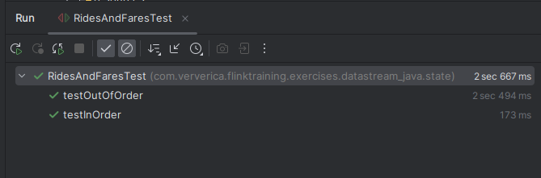

# Лабораторная 3. Потоковая обработка в Apache Flink

В этой лабораторной вы будете работать с [Apache Flink](https://flink.apache.org/) - фреймворком и движком распределённой обработки потоков данных.

## Задание

Выполнить следующие задания из набора заданий репозитория https://github.com/ververica/flink-training-exercises:
  - RideCleanisingExercise
  - RidesAndFaresExercise
  - HourlyTipsExerxise
  - ExpiringStateExercise

Решения могут быть выполнены на двух языках: **Java** или **Scala**. Каждому заданию соответствует `.java` или `.scala` файл с шаблоном решения и файл с тестом решения.  Тесты расположены в папке `test`.

Для выполнения заданий вам потребуется датасет с данными о поездках такси в Нью-Йорке https://github.com/apache/flink-training/blob/master/README.md#using-the-taxi-data-streams. Файлы `nycTaxiFares.gz` и `nycTaxiRides.gz` вы можете найти в папке `data` https://gitlab.com/ssau.tk.courses/big_data/-/tree/master/data. 

## Отчёт

- [RideCleanisingExercise](flink-training-exercises/src/main/java/com/ververica/flinktraining/exercises/datastream_java/basics/RideCleansingExercise.java)

Тесты

- [RidesAndFaresExercise](flink-training-exercises/src/main/java/com/ververica/flinktraining/exercises/datastream_java/state/RidesAndFaresExercise.java)

Тесты

- [HourlyTipsExerxise](flink-training-exercises/src/main/java/com/ververica/flinktraining/exercises/datastream_java/windows/HourlyTipsExercise.java)

Тесты

- [ExpiringStateExercise](flink-training-exercises/src/main/java/com/ververica/flinktraining/exercises/datastream_java/windows/HourlyTipsExercise.java)

Тесты

